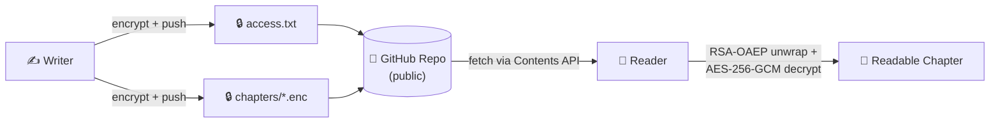

<div align="center">


**Created by [`LP-Gangster`](https://github.com/Waleed-Ahmed-05) — built with [Claude Code](https://claude.com/claude-code)**


</div>

---

## 📜 Table of Contents

1. [The Story So Far](#-the-story-so-far)
2. [Achievements Unlocked](#-achievements-unlocked)
3. [Choose Your Class](#%EF%B8%8F-choose-your-class)
4. [Access Ranks](#-access-ranks)
5. [How It Works](#-how-it-works)
6. [How To Play](#-how-to-play)
7. [Tech Stack](#-tech-stack)
8. [Security](#%EF%B8%8F-security)
9. [Credits](#-credits)

---

## 📖 The Story So Far

**Buddy-Share** is a single Windows executable — `BuddyShare.exe` — that plays two roles
in one binary. A **Writer** encrypts story chapters and pushes them to a GitHub repo.
A **Reader** fetches only the chapters they've been granted, and decrypts them locally
with a private key that never leaves their machine.

No web server. No database. No plaintext ever touches GitHub — just AES-256-GCM
ciphertext and RSA-OAEP-wrapped keys, versioned like any other commit.

---

## 🏆 Achievements Unlocked

| Spec | Feature | Status |
|------|---------|--------|
| 001 | Role Selection & Git Bootstrap | ✅ Cleared |
| 002 | Chapter Encryption (AES-256-GCM + RSA-OAEP) | ✅ Cleared |
| 003 | Reader Access Levels & Chapter Assignment | ✅ Cleared |
| 004 | Reader-Side Chapter Viewer | ✅ Cleared |
| 005 | CLI Output Styling (color, banners, status lines) | ✅ Cleared |

**200/200 automated tests passing** (GoogleTest), independently re-verified in a clean
build for every shipped spec.

---

## ⚔️ Choose Your Class

On first launch, `BuddyShare.exe` asks:

```
Are you the Writer or a Reader? [W/R]
```

This choice is **permanent** for that install (locked in `%APPDATA%\BuddyShare\.role`).

<table>
<tr>
<td width="50%" valign="top">

### ✍️ Writer
- One-time git bootstrap — links a folder to an empty GitHub repo
- Encrypts chapters (AES-256-GCM) before they ever touch disk-on-GitHub
- Grants/edits reader access ranks
- Every change auto-commits and pushes

</td>
<td width="50%" valign="top">

### 📖 Reader
- Enters the writer's GitHub username + repo + their own username
- Auto-generates an RSA keypair on first run (private key DPAPI-protected, local only)
- Fetches only chapters they're cleared to read
- Decrypts and displays — no password to remember

</td>
</tr>
</table>

---

## 🗝️ Access Ranks

Every reader is assigned one rank in the writer's `access.txt`:

| Rank | Privilege |
|------|-----------|
| 🥇 **Master** | Sees every published chapter automatically |
| 🥈 **Apprentice** | Sees a writer-assigned set of specific chapters |
| 🥉 **Novice** | Sees exactly one writer-assigned chapter |

Access is enforced at the ciphertext level — a chapter isn't just "hidden" from a lower
rank, it's genuinely undecryptable without that reader's wrapped key inside the file.

---

## 🎮 How It Works



The repo must be **public** — readers fetch via the unauthenticated GitHub Contents API,
so there's no token to manage on the reader's side. Public visibility only exposes
ciphertext and public keys; nothing decryptable leaks.

---

## 🕹️ How To Play

<details>
<summary><b>Prerequisites</b></summary>

- Windows 10+
- CMake 3.20+
- A C++17 compiler (MSVC, Clang, or MinGW/g++)
- OpenSSL (for `find_package(OpenSSL)`)
- Git (auto-installed via `winget` by the Writer bootstrap flow if missing)

</details>

<details>
<summary><b>Build from source</b></summary>

```bash
# From the project root
cmake -B build -S .
cmake --build build
```

`BuddyShare.exe` lands in `build/`.

</details>

<details>
<summary><b>Run the test suite</b></summary>

```bash
ctest --test-dir build --output-on-failure
```

200 GoogleTest cases across role selection, git bootstrap, encryption, access control,
chapter fetching/viewing, and CLI output styling.

</details>

<details>
<summary><b>Launch it</b></summary>

```bash
build\BuddyShare.exe
```

Pick your class (Writer or Reader) and follow the prompts — the CLI is colorized
(green = success, red = error, yellow = info/warning) with `NO_COLOR` support for
piped/redirected output.

</details>

---

## 🛠️ Tech Stack

| Layer | Choice |
|-------|--------|
| Language | C++17 |
| Build | CMake + Ninja/MSVC |
| Crypto | OpenSSL — AES-256-GCM, RSA-OAEP |
| Networking | WinHTTP (GitHub Contents API) |
| Local key storage | Windows DPAPI |
| Testing | GoogleTest / CTest |
| CLI styling | Hand-rolled ANSI (no third-party CLI library) |

---

## 🛡️ Security

- Private keys never leave the reader's machine — DPAPI-protected at rest, never logged,
  never transmitted. Only the *public* key is ever shared.
- Chapters are AES-256-GCM encrypted; tampered ciphertext fails loudly (auth-tag
  mismatch), never renders as garbage or partial output.
- No token is required on the reader side; the writer's optional GitHub token (for
  private-quota API calls) is masked on input and never printed.

---

## 🎖️ Credits

**Buddy-Share** was designed and built by **[`LP-Gangster`](https://github.com/Waleed-Ahmed-05)**,
end-to-end, using **[Claude Code](https://claude.com/claude-code)** — spec-first, TDD
pipeline, self-tested and independently re-tested before every merge.

<div align="center">

*GG. Go share some chapters.*


</div>
